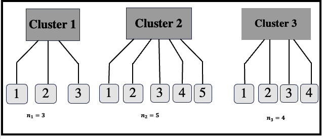
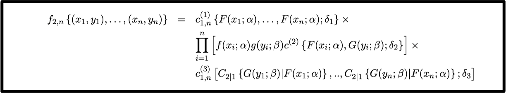
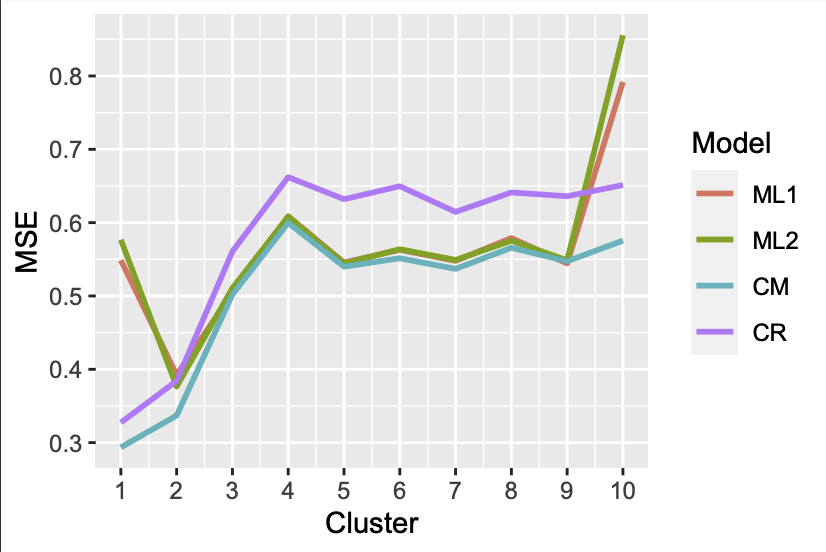

# Exchangeable 2-copula modeling of hierarchical data: Fitting and prediction


# Introduction
Grouped data are often modeled by the linear hierarchical model and its variants. 
In this project, we propose an alternative copula-based model when the number of explanatory variables per individual is 2
and we give an example of fitting to data.

Ce projet comporte deux dossiers :
-Le dossier # summary_paper donne des informations sur l'ensemble du papier et
-Le dossier # summary_application donne des informations sur l'ensemble du papier et


# Hierarchical data form presentation
We consider a model with 3 clusters as examples numbered 1, 2 and 3 having 3, 5, and 4 individuals respectively. The graph is shown in figure 

<p align="center">
  
</p>

## Target
The aim is to propose a model for this data, taking into account the cluster effect.

# Modelling
Suppose we have a cluster with $n_j$ individuals. So we have $2n_j$ variables. Let's denote $f_{2,n}$, the joint density of the $2n_j$. The exchangeable 2-copula model is written as: 



with $C_{2|1}$, the conditional distribution given by
$$C_{2|1}\{(v|u)\}=\frac{\partial C^{(2)}(u,v;\delta_2)}{\partial u} \cdot$$
The exchangeable model proposed to write the distribution of variables within a cluster with three explicitly defined copulas $C_n^1$, $C^2$ and $C_n^3$ with the following explanation

1. The copulas $C_n^1$ and $C_n^3$ are exchangeable copulas.
2. The copula $C^2$ is any bivariate copula.

To fit an exchangeable 2-copula model, we need to find 5 elements for the two (2) marginal laws $F$ and $G$ of the two variables and the three(3) copulas $C_n^{(1)}$, $C^{(2)}$ and $C_n^{(3)}$.
To do this, we use the usual procedures for fitting distributions and copulas.
    
# Data adjustment and comparison
Nous ajustons ce modèle sur des données ouvertes et traités par les modèles classiques pour comparer les résultats de la prédictions. Les données sont disponibles en tapant le mini code ci-dessous.

```r
library(lmeresampler) ; data(jsp728)
```

## Comparison with existing models

<p align="center">
  
</p>

1. Model ML1: Linear mixed model with random intercept.
2. Model ML2: Mixed linear model with random intercept and slope.
3. CM model: Regression model with our proposed model.
4. Model CR: Regression model with standard copula.


# Conclusion
The proposed "2-exchangeable copula model" improves prediction compared with existing competitors.
