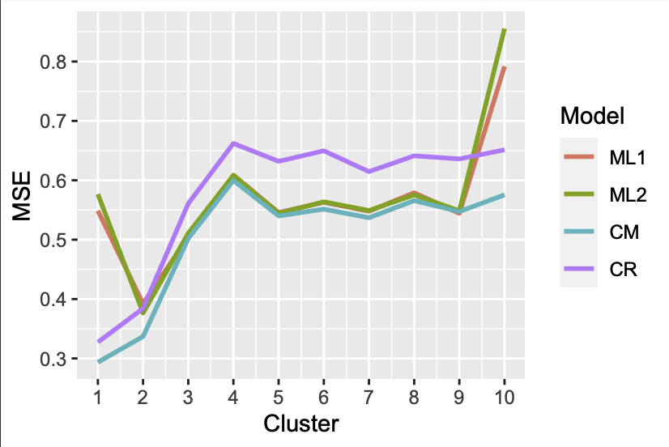

# Exchangeable 2-copula modeling of hierarchical data: Application and prediction


# Introduction
Les données groupées sont souvent modélisé par le modèle linéaire hiéarchique et ses variantes. 
Dans ce projet, nous proposons un modèle alternative à base des copules lorsque le nombre de variable explicative est 2
et nous donnons un exemple d'application.


# Présentation de la forme des données
Nous considérons un modèle avec 3 grappes comme exemples numérotés 1, 2 et 3 ayant respectivement 3, 5, et 4 individus. Le graphique se présente dans la figure 

<p align="center">
  
</p>


%```mermaid
%graph TD;
 %   A-->B;
  %  A-->C;
   % B-->D;
    %C-->D;
%```
## Objectif
L'objectif est de proposer un modélisation de ces données en prenant en compte l'effet cluster.


# Modelling


Supposons que nous avons une grappe à $n_j$ individus. Donc nous avons $2n_j$ variables. Notons $h$, la densité jointe des $2n_j$. Le modèle de 2-copule échangeable s'écrit : 

$$h(\textsf{\textbf{x}}_j,\textsf{\textbf{y}}_j) = c_{1,n_j}^{(1)}\left\{F(x_{j1};\alpha),\ldots,F(x_{jn_j};\alpha);\delta_1\right\} \times \\
\quad \overset{n_j}{\underset{i=1}{\prod}}f(x_{ji};\alpha)g(y_{ji};\beta)c_{ }^{(2)}\{F(x_{ji} ;\alpha),G(y_{ji};\beta);\delta_2\} \times \\
\quad c_{1,n_j}^{(3)}\left\[C_{2|1}\left\{G(y_{j1};\beta)|F(x_{j1};\alpha)\},\ldots,C_{2|1}\{G(y_{jn_j};\beta)|F(x_{jn_j};\alpha)\right\};\delta_3\right\],$$


$$h(\textsf{\textbf{x}}_j,\textsf{\textbf{y}}_j) = c_{1,n_j}^{(1)}\left\{F(x_{j1};\alpha),\ldots,F(x_{jn_j};\alpha);\delta_1\right\} \times \\
\quad \overset{n_j}{\underset{i=1}{\prod}}f(x_{ji};\alpha)g(y_{ji};\beta)c_{ }^{(2)}\{F(x_{ji} ;\alpha),G(y_{ji};\beta);\delta_2\} \times \\
\quad c_{1,n_j}^{(3)}\left\[C_{2|1}\left\{G(y_{j1};\beta)|F(x_{j1};\alpha)\right\},\ldots,C_{2|1}\left\{G(y_{jn_j};\beta)|F(x_{jn_j};\alpha)\right\};\delta_3\right\],$$

avec $C_{2|1}$, la distribution conditionnelle donnée par
$$C_{2|1}\{(v|u)\}=\frac{\partial C^{(2)}(u,v;\delta_2)}{\partial u} \cdot$$
Le modèle échangeable proposé pour écrire la distribution des variables à l'intérieur d'une grappe avec trois copules explicitement définies $C_n^1$, $C^2$ et $C_n^3$ avec comme explication

1. Les copules $C_n^1$ et $C_n^3$ sont des copules échangeables.
2. La copule $C^2$ est une copule bivariée quelconque.

Pour ajuster un modèle de 2-copule échangeable, il faut retrouver alors 5 éléments les deux (2) lois marginales $F$ et $G$ des deux variables et les trois(3) copules $C_n^{(1)}$, $C^{(2)}$ et $C_n^{(3)}$.
Pour cela, nous utilisons les procédures habituelles d'ajustement des distributions et des copules.
    
# Ajustement sur des données et comparaison
Nous ajustons ce modèle sur des données ouvertes et traités par les modèles classiques pour comparer les résultats de la prédictions. Les données sont disponibles en tapant le mini code ci-dessous.

```r
library(lmeresampler) ; data(jsp728)
```

## Comparaison avec les modèles existants

<p align="center">
  
</p>


# Conclusion
Le modèle proposé appelé "2-copule échangeable" améliore la prédiction par rapport à ses concurrents existants.
